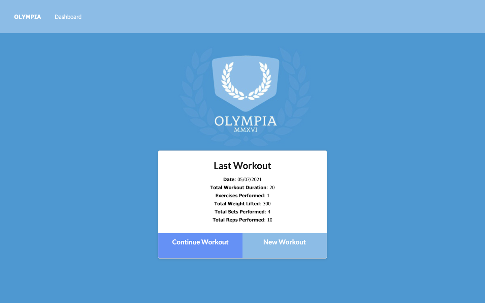
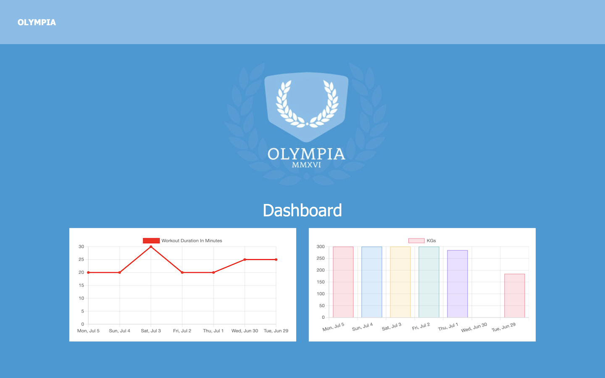

# Olympia

## Deployment

Olympia has been deployed on Heroku [https://sl-olympia.herokuapp.com/](https://sl-olympia.herokuapp.com/)

## Technologies

- Node.js using:
  - Express
  - Mongoose (MongoDB & Mongo Atlas)
  - dotenv
  - Morgan

## Description

Olympia is a fitness tracker using MongoDB to store data. It allows anonymous users to enter exercises into workouts and track the total duration and weight lifted of their last 7 workouts.

## What We Did

The front end site and seed data was provided. We refactored the front end for user experience, amended the units and added minor validation around adding null data.

We built the backend from the MongoDB models, api & html routes to the server connection allowing us to deploy to Heroku, utilising MongoDB Atlas to host our data.

## Inspiration

We used a logo and the color styling inspired by this image: Olympia Logo by artist [Jason Harvey](https://dribbble.com/jason_66).

